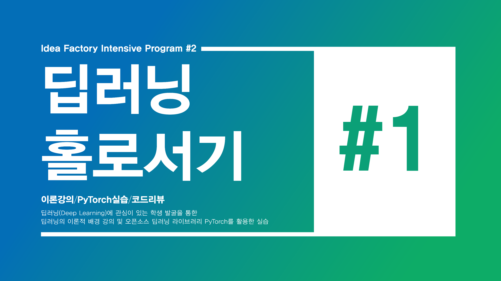

# 이 컨텐츠는.. 
> 작성자의 딥러닝 독학 및 실습을 위해 YouTube 채널 **"[Idea Factory KAIST](https://www.youtube.com/@IdeaFactoryKAIST)"** 의 
"**[딥러닝 홀로서기](https://www.youtube.com/playlist?list=PLSAJwo7mw8jn8iaXwT4MqLbZnS-LJwnBd)**"를 그대로 따라해보며 그저 **혼자 공부하는 기록**임을 알립니다.
아래에 있는 모든 내용의 원본 및 학습자료는 모두 **[여기](https://github.com/heartcored98/Standalone-DeepLearning)** 에 업로드 되어 있습니다.

